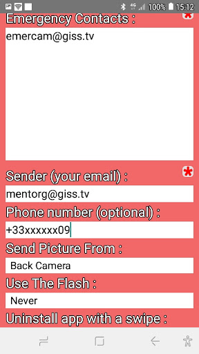

Emergency Camera is a discrete app, that hides on your phone as an invisible floating button that enables you to send an emergency picture with your localization and contact in case you get trapped in a delicate situation.

<b>Synopsis :</b>

  * Configure your emergency contacts :

    concept and programming : chevil@giss.tv

LICENSE !important

This piece of software is published under the terms of HIPPOCRATIC license that fosters the ethical use of tools in this age of digital surveillance :

https://firstdonoharm.dev/
