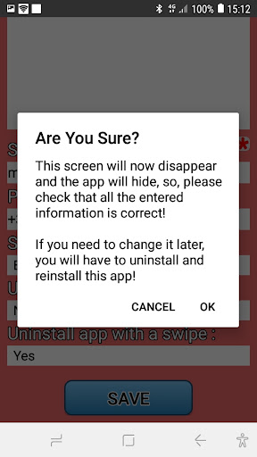
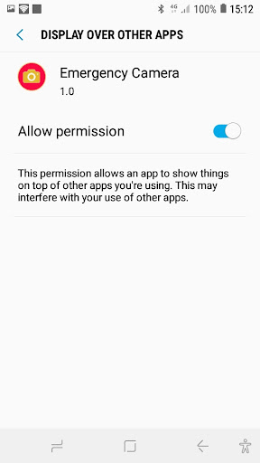
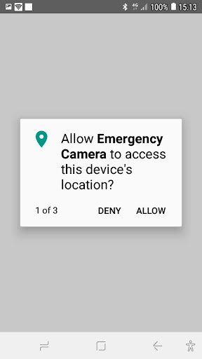
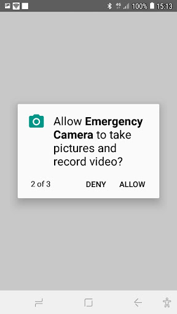
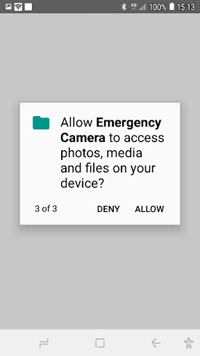
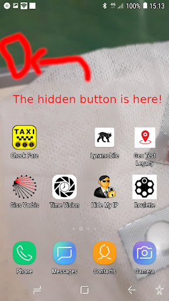
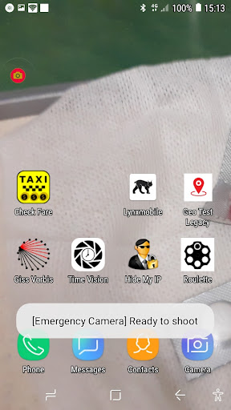

Emergency Camera is a discrete app, that hides on your phone as an invisible floating button that enables you to send an emergency picture with your localization and contact in case you get trapped in a delicate situation.

<b>Synopsis :</b>

  * Configure your emergency contacts :

  * Confirm warning / no coming back :

  * Allow app to display over other apps :

  * Allow app to access your location :

  * Allow app to take photos and record audio :

  * Allow app to access media :

  * You're set! See the hidden button :

  * Click once : button appears, Click twice : photo is taken and emergency message is sent :

    concept and programming : chevil@giss.tv

If you appreciate our developments and find this app useful,
we would appreciate that you would support our work
with a donation to [GISS.tv](http://giss.tv).

LICENSE !important

This piece of software is published under the terms of HIPPOCRATIC license that fosters the ethical use of tools in this age of digital surveillance :

https://firstdonoharm.dev/
